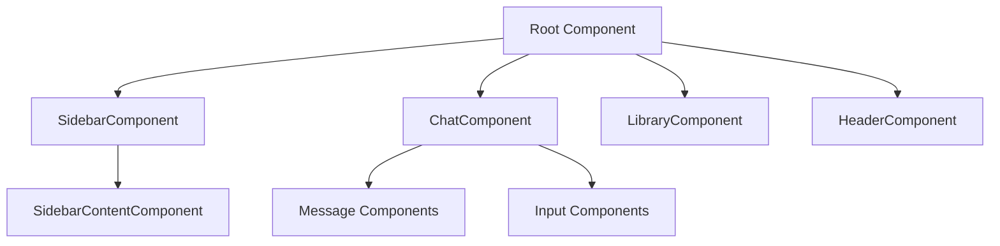

# Component System

The Notebook Native UI uses a component-based architecture where every UI element is a self-contained, composable renderable. This document explains the component system in detail.

## Renderable Trait

All UI components implement the `Renderable` trait defined in `gfx/renderable.rs`:

```rust
pub trait Renderable {
    /// Render this component and append vertices to the provided vector
    fn render(&self, renderer: &mut Renderer, app: &App, vertices: &mut Vec<Vertex>);
    
    /// Get the bounding rectangle of this component
    fn bounds(&self) -> Rect;
    
    /// Update layout based on parent constraints
    fn update_layout(&mut self, available_rect: Rect);
    
    /// Get the minimum size this component requires
    fn min_size(&self) -> Vec2;
}
```

### Key Methods

- **`render()`**: Generates vertices and queues text/icons for rendering
- **`bounds()`**: Returns the component's bounding rectangle
- **`update_layout()`**: Updates component layout when parent changes
- **`min_size()`**: Returns the minimum size the component needs

## Component Hierarchy

Components form a tree structure with a `Root` component at the top:



## Component Composition

Components can contain other components, creating a nested hierarchy:

```rust
// Example: Root contains multiple child components
let mut root = Root::new(viewport_size);
root.add_child(Box::new(SidebarComponent::new()));
root.add_child(Box::new(ChatComponent::new()));
root.add_child(Box::new(HeaderComponent::new()));
```

### Container Components

Container components manage layout of their children:

- **`Root`**: Top-level container, manages viewport
- **`VStack`**: Vertical stack layout
- **`HStack`**: Horizontal stack layout (if implemented)
- **`ScrollView`**: Scrollable container
- **`SectionList`**: Section list (scroll, hover highlight, selection border, collapsible row actions)

### Leaf Components

Leaf components don't contain other components:

- **`Button`**: Clickable button
- **`Text`**: Text display
- **`TextInput`**: Text input field
- **`Icon`**: Icon display

## Z-Ordering

Components are rendered in z-order (lower values render first/behind):

```rust
fn z_order(&self) -> i32;
```

Standard z-order layers:
- `0`: Background elements
- `10`: Sidebar, main content areas
- `20`: Glow effects
- `30`: Modals, dialogs
- `100`: Header (always on top)

## Component Validation

The renderer validates component hierarchy to prevent:
- Orphaned components (rendered without parent)
- Duplicate rendering (same component rendered multiple times)
- Invalid parent-child relationships

Components must call `renderer.validate_component()` during rendering:

```rust
impl Renderable for MyComponent {
    fn render(&self, renderer: &mut Renderer, app: &App, vertices: &mut Vec<Vertex>) {
        renderer.validate_component("my_component", Some("parent_id"), "MyComponent");
        // ... rendering code ...
    }
}
```

## Scissor Rects

Components can set scissor rects to clip rendering to their bounds:

```rust
renderer.push_scissor(rect);
// Render children (clipped to rect)
renderer.pop_scissor();
```

Scissor rects are automatically intersected for nested components.

## Component Lifecycle

1. **Creation**: Component created with initial data
2. **Layout Update**: `update_layout()` called when parent changes
3. **Rendering**: `render()` called each frame
4. **Event Handling**: Component handles events in `app.rs`

## Creating a Component

### Step 1: Define the Component

```rust
pub struct MyComponent {
    rect: Rect,
    children: Vec<Box<dyn Renderable>>,
    // ... component-specific fields
}
```

### Step 2: Implement Renderable

```rust
impl Renderable for MyComponent {
    fn render(&self, renderer: &mut Renderer, app: &App, vertices: &mut Vec<Vertex>) {
        // Validate component
        renderer.validate_component("my_component", None, "MyComponent");
        
        // Push scissor for clipping
        renderer.push_scissor(self.rect);
        
        // Render background
        let bg = Quad { /* ... */ };
        vertices.extend_from_slice(&bg.to_vertices());
        
        // Render children
        for child in &self.children {
            child.render(renderer, app, vertices);
        }
        
        // Pop scissor
        renderer.pop_scissor();
    }
    
    fn bounds(&self) -> Rect {
        self.rect
    }
    
    fn update_layout(&mut self, available_rect: Rect) {
        self.rect = available_rect;
        // Update children layout
        for child in &mut self.children {
            child.update_layout(available_rect);
        }
    }
    
    fn min_size(&self) -> Vec2 {
        Vec2::new(100.0, 50.0)
    }
}
```

### Step 3: Add to Component Tree

```rust
// In app.rs or parent component
root.add_child(Box::new(MyComponent::new()));
```

## Best Practices

1. **Encapsulation**: Components should manage their own state and layout
2. **Composition**: Prefer composition over inheritance
3. **Validation**: Always validate components during rendering
4. **Scissor Rects**: Use scissor rects for clipping
5. **Z-Order**: Set appropriate z-order for layering
6. **Layout**: Update layout when parent changes

## Component Examples

See the [Examples](../examples/basic-component.md) section for complete component implementations.

## Related Documentation

- [Rendering Pipeline](rendering.md) - How components are rendered
- [Layout System](layout.md) - How components are laid out
- [Creating Components Guide](../guides/creating-components.md) - Step-by-step guide

