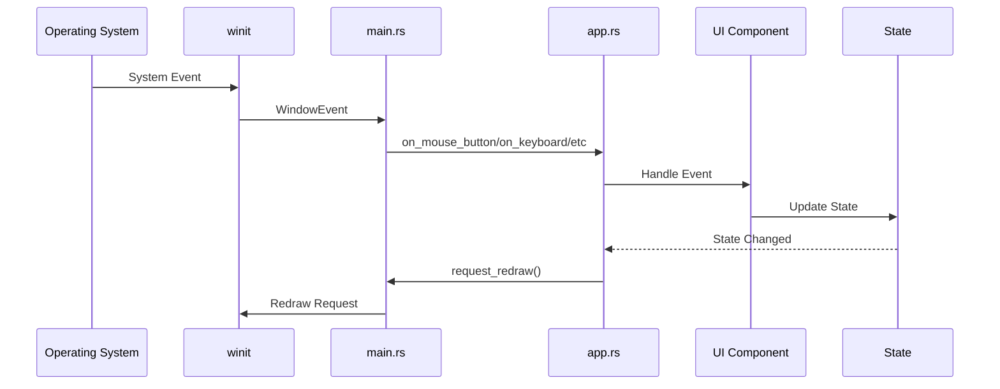

# Event System

The Notebook Native UI uses winit for window and input events, routing them through the application to UI components. This document explains the event system.

## Event Flow



## Event Types

### Window Events

- **CloseRequested**: Window close button clicked
- **Resized**: Window size changed
- **Focused**: Window gained/lost focus
- **Moved**: Window position changed
- **ScaleFactorChanged**: DPI scale changed

### Mouse Events

- **MouseInput**: Mouse button pressed/released
- **CursorMoved**: Mouse cursor moved
- **MouseWheel**: Scroll wheel moved

### Keyboard Events

- **KeyboardInput**: Key pressed/released
- **Ime**: Input method editor events (for IME input)

### Touch Events

- **Touch**: Touch input (for touchscreens)

### File Events

- **DroppedFile**: File dropped on window
- **HoveredFile**: File dragged over window
- **HoveredFileCancelled**: File drag cancelled

## Event Handling in main.rs

Events are received in `main.rs` via `ApplicationHandler`:

```rust
impl ApplicationHandler<WindowControlEvent> for NotebookApp {
    fn window_event(&mut self, event_loop: &ActiveEventLoop, _window_id: WindowId, event: WindowEvent) {
        match event {
            WindowEvent::MouseInput { button, state, .. } => {
                state.app.on_mouse_button(button, state);
            }
            WindowEvent::KeyboardInput { event, .. } => {
                state.app.on_keyboard(&event);
            }
            // ... other events
        }
    }
}
```

## Event Routing in app.rs

The `App` struct routes events to appropriate components:

```rust
impl App {
    pub fn on_mouse_button(&mut self, button: MouseButton, state: ElementState) {
        // Route to focused component or hit-test
        if let Some(component) = self.hit_test(self.mouse_pos) {
            component.handle_mouse_button(button, state);
        }
    }
    
    pub fn on_keyboard(&mut self, event: &KeyEvent) {
        // Route to focused input
        if let Some(input) = self.focused_input {
            input.handle_keyboard(event);
        }
    }
}
```

## Hit Testing

Components are hit-tested to determine which component receives events:

```rust
fn hit_test(&self, point: Vec2) -> Option<&dyn Component> {
    // Test components in reverse z-order (top to bottom)
    for component in self.components.iter().rev() {
        if component.bounds().contains_point(point) {
            return Some(component);
        }
    }
    None
}
```

## Focus Management

The application tracks focused components:

- **Focused Input**: Currently focused text input
- **Focused Component**: Component with keyboard focus
- **Accessibility Focus**: Component with screen reader focus

### Focus Events

- **Focus Gained**: Component receives focus
- **Focus Lost**: Component loses focus
- **Focus Change**: Focus moves to another component

## Event State

The `App` struct maintains event-related state:

```rust
pub struct App {
    pub mouse_pos: Vec2,
    pub modifiers: ModifiersState,
    pub pressed_keys: HashSet<KeyCode>,
    pub focused_input: Option<usize>,
    pub drag_state: DragState,
    pub hover_state: HoverState,
    // ...
}
```

## Mouse Events

### Mouse Button Events

```rust
pub fn on_mouse_button(&mut self, button: MouseButton, state: ElementState) {
    match state {
        ElementState::Pressed => {
            // Handle mouse down
            if let Some(component) = self.hit_test(self.mouse_pos) {
                component.on_mouse_down(button, self.mouse_pos);
            }
        }
        ElementState::Released => {
            // Handle mouse up
            if let Some(component) = self.hit_test(self.mouse_pos) {
                component.on_mouse_up(button, self.mouse_pos);
            }
        }
    }
}
```

### Mouse Movement

```rust
pub fn on_cursor_moved(&mut self, position: PhysicalPosition<f64>) {
    self.mouse_pos = Vec2::new(position.x as f32, position.y as f32);
    
    // Update hover state
    if let Some(component) = self.hit_test(self.mouse_pos) {
        component.on_hover(self.mouse_pos);
    }
}
```

### Mouse Wheel

```rust
pub fn on_mouse_wheel(&mut self, delta: MouseScrollDelta) {
    // Route to component under cursor
    if let Some(component) = self.hit_test(self.mouse_pos) {
        component.on_scroll(delta);
    }
}
```

## Keyboard Events

### Key Events

```rust
pub fn on_keyboard(&mut self, event: &KeyEvent) {
    // Check for shortcuts first
    if self.shortcut_registry.handle_event(event) {
        return;
    }
    
    // Route to focused input
    if let Some(input) = self.focused_input {
        input.handle_keyboard(event);
    }
}
```

### Text Input

```rust
pub fn on_char_received(&mut self, ch: char) {
    if let Some(input) = self.focused_input {
        input.insert_char(ch);
    }
}
```

## Shortcuts

Keyboard shortcuts are handled via `ShortcutRegistry`:

```rust
shortcut_registry.register(
    Shortcut::new(Modifiers::CTRL, KeyCode::KeyS),
    || { /* Save action */ }
);
```

## Drag and Drop

### File Drag and Drop

```rust
pub fn on_file_drop(&mut self, paths: Vec<PathBuf>, position: Vec2) {
    // Handle file drop
    if let Some(component) = self.hit_test(position) {
        component.on_file_drop(paths, position);
    }
}
```

### Window Dragging

```rust
pub fn on_window_drag(&mut self) {
    if self.is_dragging_window {
        self.window_proxy.send(WindowControlEvent::DragWindow).ok();
    }
}
```

## Touch Events

Touch events are supported for touchscreens:

```rust
pub fn on_touch(&mut self, touch: &Touch) {
    match touch.phase {
        TouchPhase::Started => {
            self.active_touches.insert(touch.id, Vec2::new(touch.location.x, touch.location.y));
        }
        TouchPhase::Moved => {
            // Update touch position
        }
        TouchPhase::Ended => {
            self.active_touches.remove(&touch.id);
        }
        TouchPhase::Cancelled => {
            self.active_touches.remove(&touch.id);
        }
    }
}
```

## Event Propagation

Events propagate through the component tree:
1. Hit test determines target component
2. Event sent to component
3. Component handles or propagates to children
4. Event can be consumed to stop propagation

## Redraw Requests

After handling events, components request redraws:

```rust
// In main.rs
state.window.request_redraw();
```

This triggers the next frame to be rendered.

## Related Documentation

- [Component System](components.md) - How components handle events
- [UI Events Module](../modules/ui/events.md) - Event types and utilities
- [Shortcuts Module](../modules/ui/shortcuts.md) - Keyboard shortcuts

