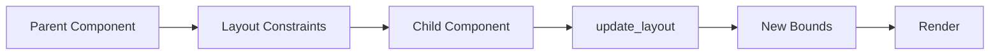

# Layout System

The Notebook Native UI uses a flexible layout system based on rectangles, alignment, and direction. This document explains the layout system.

## Layout Primitives

### Rect

The `Rect` struct represents a rectangle with position and size:

```rust
pub struct Rect {
    pub x: f32,
    pub y: f32,
    pub width: f32,
    pub height: f32,
}
```

### Alignment

The `Alignment` enum specifies alignment options:

```rust
pub enum Alignment {
    Start,   // Left (horizontal) or Top (vertical)
    Center,  // Center
    End,     // Right (horizontal) or Bottom (vertical)
}
```

### Direction

The `Direction` enum specifies layout direction:

```rust
pub enum Direction {
    Horizontal,  // Left to right
    Vertical,    // Top to bottom
}
```

## Layout Flow



## Layout Updates

Components update their layout when parent changes:

```rust
fn update_layout(&mut self, available_rect: Rect) {
    self.rect = available_rect;
    
    // Update children
    for child in &mut self.children {
        child.update_layout(available_rect);
    }
}
```

## Layout Helpers

The `ui::core::layout` module provides layout helper functions:

### Centering

```rust
// Center horizontally
let x = layout::center_x(&parent, child_width);

// Center vertically
let y = layout::center_y(&parent, child_height);

// Center both
let pos = layout::center(&parent, child_size);
```

### Alignment

```rust
// Align right
let x = layout::align_right(&parent, child_width, padding);

// Align bottom
let y = layout::align_bottom(&parent, child_height, padding);
```

### Stacking

```rust
// Stack vertically
let rects = layout::stack_vertical(&parent, &heights, spacing, padding);

// Stack horizontally
let rects = layout::stack_horizontal(&parent, &widths, spacing, padding);
```

## Container Layouts

### VStack

Vertical stack layout:

```rust
let mut vstack = VStack::new(spacing);
vstack.add_child(Box::new(child1));
vstack.add_child(Box::new(child2));

vstack.update_layout(available_rect);
```

### HStack

Horizontal stack layout (if implemented):

```rust
let mut hstack = HStack::new(spacing);
hstack.add_child(Box::new(child1));
hstack.add_child(Box::new(child2));

hstack.update_layout(available_rect);
```

## Text Layout

The `ui::core::text` module provides text layout helpers:

### Text Metrics

```rust
let metrics = TextMetrics::approximate(font_size, char_count);
// or
let metrics = TextMetrics::from_parley(width, height, baseline);
```

### Text Positioning

```rust
// Left-aligned
let pos = text::left_aligned(&rect, font_size, padding);

// Center-aligned
let pos = text::center_aligned(&rect, text_width, font_size);

// Right-aligned
let pos = text::right_aligned(&rect, text_width, font_size, padding);
```

## Section Layout

The `ui::core::container` module provides section-based layouts:

### Section

A section with title and items:

```rust
let section = Section::new("Title", item_height);
section.item_count = items.len();

// Get item rect
let item_rect = section.item_rect(&container_rect, y_offset, index, padding);
```

### SectionStack

Vertical stack of sections:

```rust
let mut stack = SectionStack::new(spacing);
stack.add_section(section1);
stack.add_section(section2);

// Get layout
let layout = stack.layout(&container_rect);
```

## Responsive Layout

Layout adapts to viewport size:

```rust
pub fn resize(&mut self, size: (u32, u32)) {
    self.viewport_size = Vec2::new(size.0 as f32, size.1 as f32);
    
    // Update root layout
    self.root.update_layout(Rect::new(0.0, 0.0, size.0 as f32, size.1 as f32));
}
```

## Layout Constraints

Components can specify minimum sizes:

```rust
fn min_size(&self) -> Vec2 {
    Vec2::new(100.0, 50.0)  // Minimum width and height
}
```

## Padding and Spacing

Standard padding and spacing values:

```rust
const PADDING_SMALL: f32 = 8.0;
const PADDING_MEDIUM: f32 = 16.0;
const PADDING_LARGE: f32 = 24.0;

const SPACING_SMALL: f32 = 8.0;
const SPACING_MEDIUM: f32 = 16.0;
const SPACING_LARGE: f32 = 24.0;
```

## Inset Rectangles

Create inset rectangles for padding:

```rust
// Inset all sides
let inner = rect.inset(padding);

// Inset each side separately
let inner = rect.inset_by(left, top, right, bottom);
```

## Related Documentation

- [UI Core Module](../modules/ui/core.md) - Core layout primitives
- [Component System](components.md) - How components use layout
- [Layout Utilities](../modules/utils/layout.md) - Additional layout utilities

