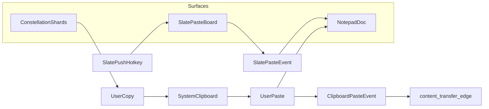

# Notion Bridge + Knowledge Graph Draft

## Status

- Draft guidance document
- **Implementation (native-ui):** local SQLite at `data/knowledge_graph.db` (events, interned `refs`, materialized `edges`); Rust enums and `append_event_with_edges` validate endpoint pairs before insert.

## Problem Statement

The current Constellar graph is optimized for interaction flow (chat turns and branch navigation). This is useful for provenance and UI navigation, but it is not yet a durable, user-legible knowledge structure independent of turn boundaries.

Today, content can span shards and notes without a single place that records **how** the user connected those pieces. This draft ties linkage to **explicit user and product events** (mentions, paste, slate, compile context)—not to inferred semantics.

## Principles & Invariants

These rules keep the graph auditable and avoid hidden linkage.

### Events

- Every graph-changing action emits an **`event`** with a stable **`event_id`**.
- Each event records **`actor`**: `user` | `system_explicit_policy` (only where product policy is documented and user-visible).
- Each event records **`timestamp`** (monotonic ordering within a session where relevant).
- Optional: store events in an **append-only** log for replay and debugging.

### Edges

- **No edge without an event**: every edge stores **`created_by_event_id`** referencing the event that justified it.
- Each edge records **`edge_kind`**, **endpoints** (typed refs), and optional payload (e.g. span, slate slot index).
- **No inferred semantic edges**: no similarity scores, clustering, or background NLP that creates links without a corresponding event.

### Knowledge nodes

- A **`knowledge_node`** is an **opaque container**. It does not denote “a sentence,” “a concept,” or a fixed granularity.
- **Meaning in the graph comes only from edges** (and containment): what the user linked, pasted, stashed, or attached—not from an intrinsic node type beyond “container.”

### Violations

- Missing `created_by_event_id`, unknown endpoints, or edges attributed to silent metrics are **invalid** and should fail validation in implementation.

## Product Direction

Use a Notion bridge rather than full Notion dependency:

- Keep Notebook as local-first source of truth for editing and graph operations
- Add Notion as external ingest/sync source
- Integrate through the Data tab as the integration control plane
- Converge toward a wiki-like experience via data model and linking, not immediate UI cloning

## Core Architecture: Dual Graph Model

Introduce two linked graph layers:

1. Interaction Graph (existing Constellar)
   - Unit: turn shard (user + assistant pair and branch topology)
   - Purpose: conversation replay, branch navigation, prompt compile context
   - Keep current behavior and rendering model
2. Knowledge Graph (new)
   - Unit: **`knowledge_node`** — opaque bundle the user connects to other entities
   - Purpose: durable retention of **explicit** relationships and containers for whatever the user links together
   - Independent of conversation turn structure

The two graphs are connected only by explicit, observable edges.

## Canonical Knowledge Model

Represent user-linked content (notepad, Notion, imported docs, user-promoted shards, slate items) in a normalized shape. Payload text inside a node is optional implementation detail; **the graph is defined by events and edges.**

### Entity Types

- `document`
  - Logical container (notepad document, Notion page, imported paper/note)
- `knowledge_node`
  - **Opaque container**: holds arbitrary linked material; granularity is not prescribed (not “one concept per node” unless the user works that way)
- `source_artifact`
  - External source references (paper, URL, Notion block/page id)
- `interaction_shard_ref`
  - Link to Constellar shard lineage
- `usage_event`
  - Record that a knowledge node (or bundle) was used as compile/generation context

### Event Types (Examples)

Each event type below, when persisted, may create or update edges only through **`created_by_event_id`**:

| Event kind | Role |
|------------|------|
| `MentionInsertEvent` | User inserted a mention token or picked from mention UI |
| `ClipboardPasteEvent` | User pasted from system clipboard into a surface (chat, notepad, etc.) |
| `ClipboardCopyEvent` | User copied from a surface (optional: enrich clipboard with internal metadata for paste pairing) |
| `ContentTransferEvent` | Paste (or structured paste) that connects known source ref to known target ref |
| `SlatePushEvent` | User stashed selection or snippet onto the Slate paste board |
| `SlatePasteEvent` | User inserted content from Slate into a surface |
| `SlateReorderEvent` | User reordered items on Slate |
| `SlateRemoveEvent` | User removed an item from Slate |
| `CompileContextAttachEvent` | User attached node(s) as context for compile/send |

Implementation may collapse copy+paste into a single **`ContentTransferEvent`** when source and destination are both identified.

### Edge Types (Explicit Only)

- **`contains(parent_ref -> child_ref)`** — nesting: allowed pairs include `document -> document_segment`, `document_segment -> knowledge_node`, and `document -> knowledge_node` (flat anchor). `document_segment` external ids are stable composite keys, e.g. `document_id::block_id` aligned with Stylus block ids.
- `mentions(source_node -> target_node_or_entity)` — user-authored mention link
- **`generated_from(knowledge_node -> interaction_shard_ref)`** — provenance from shards: **many-to-many**. There is **no** uniqueness constraint on `(node, shard)`: a knowledge node may have **0..N** `generated_from` edges to distinct shards, and a shard may feed **0..N** nodes (repeatable edges; duplicates may be deduped by `(node, shard, event)` in storage if desired).
- **`used_in(from_entity -> usage_event)`** — compile/send context: `from_entity` is typically a **mention target** (shard, paper, graph, document) as included in the compile payload; one **`usage_event`** ref is minted per compile/send that carries mentions, with one **`used_in`** edge per mention.
- `references_source(knowledge_node -> source_artifact)`
- **`content_transfer(source_ref, target_ref)`** — **no semantic predicate**: records that the user moved content from A to B at time T (typically backed by `ContentTransferEvent` / `ClipboardPasteEvent`). Endpoints may be shard id, document id, block id, selection span, or slate item id as available.

### Endpoint constraint matrix (validation)

Implementation must **reject** edges outside this matrix (fail loud).

| `edge_kind` | Allowed `from` (`ref_kind`) | Allowed `to` (`ref_kind`) |
|-------------|-----------------------------|---------------------------|
| `contains` | `document` | `document_segment` or `knowledge_node` |
| `contains` | `document_segment` | `knowledge_node` |
| `mentions` | `knowledge_node`, `document`, `document_segment` | `knowledge_node`, `document`, `shard`, `paper`, `graph`, `source_artifact` |
| `generated_from` | `knowledge_node` | `shard` |
| `used_in` | `knowledge_node`, `document`, `shard`, `paper`, `graph` | `usage_event` |
| `references_source` | `knowledge_node` | `source_artifact` |
| `content_transfer` | any tracked `ref_kind` | any tracked `ref_kind` |

### Storage encoding (native-ui SQLite)

- **`refs`**: `(ref_kind, external_id)` interned to integer ids; edges reference ids only.
- **`events`**: `kind`, `actor`, `timestamp_ms`; optional **`payload` BLOB** for compact JSON (ids, lengths, graph_id)—**not** full note or shard body text.
- **`edges`**: materialized rows for query; **`created_by_event_id`** FK to `events`; optional **`meta` BLOB** for spans or tiny metadata.
- On-disk enums are **small integers**; Rust maps to `RefKind`, `EdgeKind`, `EventKind`, `Actor`.

Naming note: `content_transfer` is the durable edge; “transfer_link” is synonymous in discussion.

### Graph Construction Rule

No inferred semantic edges.

All edges must come from explicit product events:

- Direct user mention/link action (`MentionInsertEvent`)
- Explicit generation lineage (`generated_from`; user action or documented explicit policy)
- Explicit usage as context in compile/send (`CompileContextAttachEvent` → `usage_event`)
- Containment from document structure
- **Cross-interface copy/paste** when source/target can be attributed (`ContentTransferEvent` → `content_transfer`)
- **Slate**: stash (`SlatePushEvent`), paste out (`SlatePasteEvent`), reorder/remove (their respective events)

### Copy/Paste as First-Class Linking

Many users already connect ideas by copying from Constellation shards into Notepad (or the reverse). Treat that as a **primary** linking gesture:

1. On **copy**, optionally attach **structured provenance** (e.g. internal MIME type, hidden prefix, or parallel metadata) so paste targets know origin when the app controls both sides.
2. On **paste** into a destination surface, emit **`ClipboardPasteEvent`** and, when both ends are known, **`ContentTransferEvent`** with **`content_transfer`** edges (e.g. shard ↔ notepad document, optionally block/selection span).
3. If only plain text is available, still record paste event and destination; **link richness depends on what the session knew**, not on guessing.

This does not require NLP: linkage strength = **what the user actually did**, recorded as events.

## Slate (Paste Board)

A **secondary right-side panel** (“Slate”) acts as an application-managed paste board—not the OS clipboard alone.

### UI

- Docked **right** (alongside or outward from existing sidebar); **toggle** visibility.
- **Scrollable list** of **unbounded** items (practical limits are implementation detail).
- Each item shows a **short preview** and **source provenance** when known (shard id, doc id, etc.).

### Actions (All Emit Explicit Events)

- **Push** current selection, focused shard excerpt, or focused block → Slate (`SlatePushEvent`).
- **Paste** from Slate into chat composer, notepad, or other targets (`SlatePasteEvent`).
- **Reorder** items on Slate (`SlateReorderEvent`).
- **Remove** item from Slate (`SlateRemoveEvent`).

Graph edges should reference Slate items only through **event-backed** operations (same invariants as above).

### Default Hotkey: Stash to Slate

- **Default proposal: `Ctrl+Alt+V`** — stash selection/focused snippet onto Slate (avoid collision with Bold **`Ctrl+B`** in rich editors and common paste **`Ctrl+V`**).
- Hotkey should be **configurable** in product settings.
- Document alternatives for users who remap: `Ctrl+Shift+B`, chord shortcuts, etc.

### Hotkey Conflict Note

| Binding | Typical conflict |
|---------|------------------|
| `Ctrl+B` | Bold in Wisk and many editors |
| `Ctrl+V` | Paste from OS clipboard |
| **`Ctrl+Alt+V`** | Lower collision; suitable default for “stash to Slate” |

## Transfer Flow (Conceptual)

## Notepad Integration Strategy

Treat notepad as a first-class producer of document structure and user-defined links:

1. Save/update note document
2. Persist document and containment edges
3. Persist user-authored mentions/links
4. Persist explicit source references and **paste/transfer** events where applicable
5. Preserve source spans for traceability when available

Notepad remains the editing UX. The knowledge graph remains user-defined and event-defined.

## Interaction Graph Integration Strategy

Keep one-message-per-shard behavior for agent interaction. Do not auto-create semantic links.

When a new knowledge node is created from a shard (user action or explicit generation setting):

1. Keep shard in interaction graph
2. Create node in knowledge graph
3. Emit `generated_from` edge with **`created_by_event_id`**

When mentions are included in compile/send:

1. Persist a **`CompileContextAttach`** / **`usage_event`** (synthetic ref id per send).
2. Emit **`used_in`** from **each mention target** (shard, paper, graph, notepad document, etc.) **to** that `usage_event`.

## Notion Bridge Strategy

### Principles

- Fast setup, minimal required mapping
- One-way ingest first (Notion -> Notebook knowledge model)
- Two-way sync only after stability

### Ingest Shape

Map Notion pages/databases into:

- `document` records with source metadata
- containment structure under document scope
- optional `knowledge_node`s only when explicitly created by user actions/policies
- no implicit semantic links

### Sync Metadata

Track:

- external workspace/source identifiers
- last sync cursor and checkpoint timestamps
- per-item sync status and error details

## Data Tab as Integration Control Plane

Add integration controls under Data:

- Connect workspace
- Choose sources (pages/databases)
- Sync now
- Last sync status and failures
- Retry failed items

Data remains the operational hub for all external knowledge connections.

## Retrieval and Compile Policy

Use separate retrieval pools with explicit provenance:

- Interaction graph: high recency, branch-local relevance
- Knowledge graph: explicit user-linked nodes and lineage

Suggested behavior:

- Chat compile defaults to interaction-local context first
- Pull knowledge nodes from explicit selection history, mention/link paths, and **`content_transfer`** adjacency where implemented
- Include provenance in returned context blocks

## Proposed Phased Rollout

### Phase 1: Foundation

- Define canonical knowledge schema (entities, events, edges, invariants)
- Build local graph storage and query primitives
- Add explicit edge/event writer infrastructure (`event_id`, `created_by_event_id`)

### Phase 2: Notepad + Clipboard + Slate

- Persist containment and mention-driven links from notes
- Implement Slate UI and **`SlatePushEvent` / `SlatePasteEvent`** (default stash **`Ctrl+Alt+V`** configurable)
- Wire **cross-surface paste** to **`ContentTransferEvent`** and **`content_transfer`** edges where refs resolve
- Mention picker support for knowledge nodes
- Expose basic graph inspection/debug views

### Phase 3: Notion Bridge (One-way)

- Auth + source selection + sync jobs
- Import documents and containment metadata
- Index into retrieval pipeline

### Phase 4: Knowledge-First UX

- Surface explicitly linked nodes while editing notepad
- Add explicit “create container from shard” actions (still event-backed)
- Improve cross-document wiki navigation

### Phase 5: Optional Two-way Notion Sync

- Controlled write-back for selected fields
- Conflict visibility and deterministic reconciliation policy

## Non-Goals (for initial implementation)

- Full Notion UI parity
- Real-time collaborative Notion-style editing
- Automatic semantic linkage and hidden relevance scoring
- Ontology or fixed granularity for `knowledge_node` content

## Open Decisions

- Storage backend for knowledge graph and edges (SQL tables vs graph-native store)
- Default node creation policy (manual-only vs manual + explicit generation setting)
- Clipboard enrichment strategy (internal MIME vs marker prefix vs none—tradeoffs for cross-app paste)
- Conflict resolution policy for future two-way sync
- Permission model for external workspace scopes

## Implementation Touchpoints (Future)

When implementing Slate and graph emission:

- Centralized clipboard paths in **`native-ui/src/app.rs`** (`clipboard_apply_copy`, `clipboard_apply_paste`; notepad focus id **`Some(5)`**, chat **`Some(0)`**): after successful paste, emit **`ClipboardPasteEvent`** / **`ContentTransferEvent`** when origin metadata is present.
- Sidebar layout: align with existing window/sidebar patterns (`native-ui/docs/modules/ui/windows.md`).

## Failure and Safety Expectations

Given the research codebase posture, prefer fail-fast behavior:

- Hard-fail on malformed sync payloads
- Hard-fail on invariant violations (missing `created_by_event_id`, invalid edge endpoints)
- Surface explicit error states in Data integration status

## Success Criteria

- Users can connect Notion and ingest selected content from Data in minutes
- Notepad and chat actions produce explicit, auditable graph edges
- **Paste and Slate actions** produce **`content_transfer`** or Slate events users can inspect
- Interaction graph and knowledge graph remain distinct but linked
- Graph behavior is legible: every edge traces to a **recorded event**
