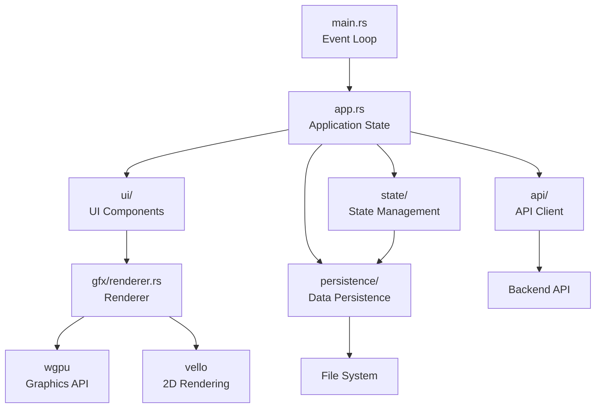
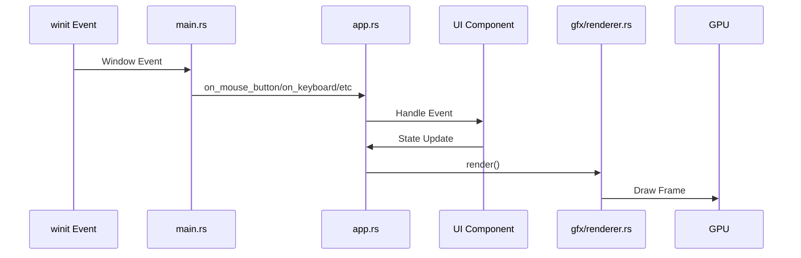
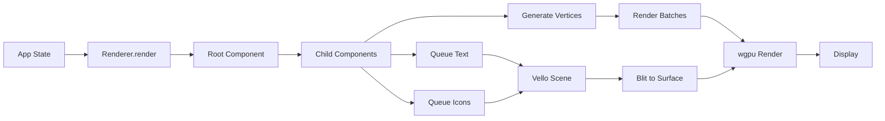
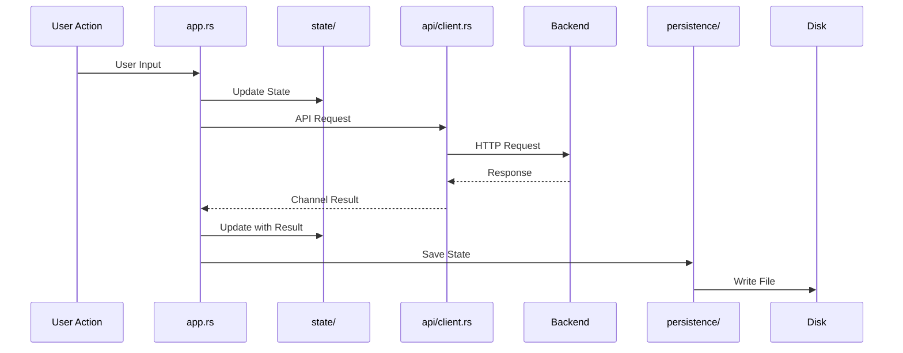

# Architecture Overview

The Notebook Native UI follows a component-based architecture with clear separation between application logic, UI components, and rendering. This document provides a high-level overview of the system architecture.

## System Architecture



## Core Components

### Application Layer (`app.rs`)

The `App` struct is the central coordinator that:

- Manages all UI windows and components
- Handles event routing from winit
- Coordinates state updates
- Manages async API operations via channels
- Maintains the component hierarchy root

### UI Component System (`ui/`)

The UI system is built on a component-based architecture:

- **Core Primitives** (`core.rs`): `Rect`, `Alignment`, `Direction`, layout helpers
- **Components** (`components/`): Container components like `Root`, `VStack`
- **Windows** (`window.rs`, `chat_window.rs`, etc.): High-level window components
- **Input Components** (`text_input.rs`, `button.rs`): Interactive UI elements
- **Style System** (`style.rs`): Theming and styling constants

### Graphics Rendering (`gfx/`)

The rendering system uses a hybrid approach:

- **Renderer** (`renderer.rs`): Main rendering coordinator
  - Manages wgpu device, surface, and pipelines
  - Integrates vello for 2D graphics and text
  - Handles scissor rects for clipping
  - Batches render operations for efficiency

- **Renderable Trait** (`renderable.rs`): Interface for all renderable components
- **Components** (`components/`): Graphics-specific rendering components
- **Types** (`types.rs`): Vertex, color, and shader data structures

### State Management (`state/`)

Application state is organized into logical modules:

- **ChatState**: Conversation history, current message
- **UIState**: UI preferences (sidebar open/closed, etc.)
- **SettingsState**: Application settings
- **InsightsState**: Insights data

### API Client (`api/`)

Async HTTP client for backend communication:

- Uses `reqwest` for HTTP requests
- Returns results via channels to avoid blocking
- Handles all API endpoints (chat, collections, papers, etc.)

### Persistence (`persistence/`)

Data persistence layer:

- Saves conversations, documents, and settings to disk
- Uses JSON serialization via serde
- Loads data on application startup

## Data Flow

### Event Flow



### Rendering Pipeline



### State Update Flow



## Component Hierarchy

The UI follows a tree structure:

```
Root
├── SidebarComponent
│   └── SidebarContentComponent
├── ChatComponent
├── LibraryComponent
├── DataComponent
├── SettingsComponent
├── NotepadComponent
└── HeaderComponent (highest z-order)
```

Each component:
- Implements the `Renderable` trait
- Manages its own layout and bounds
- Can contain child components
- Handles its own events
- Renders itself and its children

## Key Design Principles

1. **Component-Based**: Every UI element is a self-contained, composable component
2. **Separation of Concerns**: Clear boundaries between app logic, UI, rendering, and state
3. **Type Safety**: Leverages Rust's type system for compile-time guarantees
4. **Performance**: GPU-accelerated rendering, efficient batching, and culling
5. **Modularity**: Each module has a single, well-defined responsibility

## Technology Stack

- **winit**: Window creation and event handling
- **wgpu**: Modern graphics API (Vulkan/Metal/DirectX 12)
- **vello**: GPU-accelerated 2D graphics
- **parley**: Advanced text layout
- **glam**: Fast math library
- **tokio**: Async runtime
- **reqwest**: HTTP client

## Next Steps

- Learn about the [Component System](components.md)
- Understand the [Rendering Pipeline](rendering.md)
- Explore [Event Handling](events.md)
- Review [State Management](state.md)
- Study the [Layout System](layout.md)

