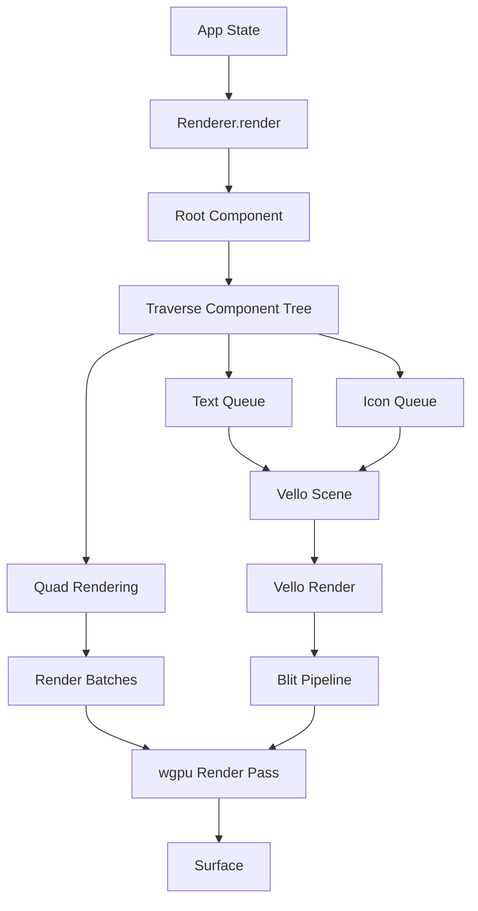

# Rendering Pipeline

The Notebook Native UI uses a hybrid rendering approach combining wgpu for quad rendering and vello for advanced 2D graphics, text, and icons. This document explains the rendering pipeline in detail.

## Rendering Architecture



## Renderer Initialization

The `Renderer` is initialized in `main.rs`:

```rust
let renderer = pollster::block_on(Renderer::new(window.clone()));
```

### Initialization Steps

1. **Create wgpu Instance**: Initialize graphics backend
2. **Create Surface**: Get window surface for rendering
3. **Request Adapter**: Find suitable GPU adapter
4. **Create Device**: Get device and queue
5. **Configure Surface**: Set surface format and size
6. **Create Pipelines**: Set up render and blit pipelines
7. **Initialize Vello**: Create vello renderer and target texture
8. **Create Font Context**: Initialize Parley font context

## Rendering Flow

### Frame Rendering

Each frame, `Renderer::render()` is called:

```rust
pub fn render(&mut self, app: &mut App) -> Result<(), wgpu::SurfaceError>
```

### Rendering Steps

1. **Clear Component Validation**: Reset validation state
2. **Get Surface Texture**: Acquire next surface texture
3. **Create Render Pass**: Set up wgpu render pass
4. **Render Component Tree**: Traverse and render all components
5. **Render Vello Scenes**: Render text and icons via vello
6. **Blit Vello Output**: Copy vello texture to surface
7. **Present Frame**: Submit command buffer and present

## Component Rendering

Components render themselves by:

1. **Generating Vertices**: Create quad vertices for backgrounds/borders
2. **Queueing Text**: Queue text via `renderer.queue_text()`
3. **Queueing Icons**: Queue icons via `renderer.queue_icon()`
4. **Setting Scissor Rects**: Clip rendering to bounds
5. **Rendering Children**: Recursively render child components

### Vertex Generation

Simple UI elements (buttons, backgrounds) are rendered as quads:

```rust
let quad = Quad {
    position: Vec2::new(x, y),
    size: Vec2::new(width, height),
    color: Vec4::new(r, g, b, a),
    corner_radius: 8.0,
};
vertices.extend_from_slice(&quad.to_vertices());
```

### Text Rendering

Text is rendered via vello + Parley:

```rust
renderer.queue_text(
    &text,
    position,
    color,
    font_size,
);
```

The renderer:
1. Queues text commands during component rendering
2. Creates Parley layouts for all queued text
3. Renders text to vello scene
4. Blits vello output to surface

### Icon Rendering

Icons (SVG) are rendered via vello:

```rust
renderer.queue_icon(
    &icon_name,
    position,
    size,
    color,
);
```

Icons are:
1. Parsed from SVG files
2. Cached in `IconCache`
3. Rendered to vello scene
4. Blitted to surface

## Render Batches

Vertices are organized into batches with scissor rects:

```rust
struct RenderBatch {
    vertices: Vec<Vertex>,
    scissor: Option<ScissorRect>,
}
```

Batches are:
- Created when scissor rect changes
- Rendered in order
- Clipped by their scissor rect

## Scissor Rects

Scissor rects clip rendering to component bounds:

```rust
renderer.push_scissor(rect);
// Render children (clipped)
renderer.pop_scissor();
```

Scissor rects:
- Are automatically intersected for nested components
- Use UI coordinates directly (no conversion needed)
- Enable efficient clipping on GPU

## Vello Integration

Vello is used for:
- Text rendering (via Parley)
- Icon rendering (SVG paths)
- Complex 2D graphics

### Vello Rendering Process

1. **Create Scene**: Create vello `Scene` for frame
2. **Queue Operations**: Add fills, strokes, text, icons
3. **Render to Texture**: Render scene to offscreen texture
4. **Blit to Surface**: Copy texture to main surface

### Blit Pipeline

The blit pipeline copies vello output to the main surface:

```rust
// Create blit pipeline
let blit_pipeline = device.create_render_pipeline(...);

// Render vello texture to surface
render_pass.set_pipeline(&blit_pipeline);
render_pass.set_bind_group(0, &blit_bind_group, &[]);
render_pass.draw(0..3, 0..1);
```

## Performance Optimizations

### Batching

- Vertices are batched by scissor rect
- Reduces draw calls
- Improves GPU utilization

### Culling

- Components check visibility before rendering
- Off-screen components are skipped
- Reduces unnecessary work

### Caching

- Text measurements are cached
- Glyph positions are cached
- Icons are cached in `IconCache`

### Texture Pools

- Text and icon textures are pooled
- Reused across frames
- Reduces allocation overhead

## Shader Pipeline

### UI Shader

The UI shader (`gfx/shaders/ui_shader.wgsl`) is a single pipeline for all UI quads. It provides:

- **Vertex stage**: Projection and pass-through of quad data (position, color, quad_pos, quad_size, corner_radius, effect flags).
- **Fragment stage**: Branches by quad type — plain rounded rects, borders (negative corner_radius), glows, **bubble** (velocity/cursor-driven border wobble for chat bubbles), and **liquid slider** (stretch in direction of motion for the nav bar).

Effect selection is per-quad via vertex attributes (`bubble`, `slider`) and conventions (e.g. negative corner_radius for borders). Uniforms supply time, scroll velocity, cursor, and slider velocity each frame.

**Full reference**: [Shader system](../modules/gfx/shader-system.md) — uniforms layout, vertex format, effect branches, and how to add new effects.

### Blit Shader

The blit shader (`shaders/blit.wgsl`) handles:
- Texture sampling
- Color space conversion
- Alpha blending

## Coordinate System

The rendering system uses:
- **Top-left origin**: (0, 0) is top-left
- **Y-down**: Y increases downward
- **Pixel coordinates**: Direct pixel values
- **Orthographic projection**: No perspective

## Rendering Order

Components are rendered in z-order:
1. Background (z-order 0)
2. Main content (z-order 10)
3. Glow effects (z-order 20)
4. Modals (z-order 30)
5. Header (z-order 100)

That ordering is the **component tree** traversal sort. **Text and icons** also depend on `CompositeLayer` in `src/gfx/renderer.rs` (see below): a label can sit under later layers if it was queued on an earlier compositing layer, even when the parent component’s z-order is high.

## GPU compositing layers

Vello-backed **queued** text and icons carry the renderer’s current `CompositeLayer` at queue time (`Renderer::set_composite_layer`). Each frame, `Renderer` draws geometry and runs batched Vello blits **per layer** in a fixed order (`COMPOSITE_DRAW_ORDER` in `src/gfx/renderer.rs`):

1. `Background`
2. `MainContent`
3. `ConstellationText`
4. `SidebarChrome`
5. `ComposerChrome`
6. `HudChrome`
7. `Modal`

`ConstellationText` runs **after** `MainContent`. Any queued label whose layer is still `MainContent` or `SidebarChrome` can end up **under** constellation text and look missing. Overlays that must read on top (constellation **tooltip**, **right-click context menu**) therefore switch to `HudChrome` before queueing their `Text`—see `src/gfx/components/chat/window.rs`.

**Sidebar (`src/gfx/components/sidebar_content.rs`):** **Quads** (panel chrome, row highlights, solid buttons) stay on `SidebarChrome`. **Every** sidebar string—section titles (“Conversations”, “Documents”, “Insights”), “+” button labels, and scroll-clipped **row** labels—must be queued on `HudChrome`: wrap each `Text::render` with `set_composite_layer(HudChrome)`, then restore `SidebarChrome` before the next `add_quad` / `queue_icon`. If only row labels use `HudChrome` while titles remain on `SidebarChrome`, either headers or rows can disappear depending on blit ordering; matching **all** sidebar typography to the same `HudChrome` pattern as the context menu keeps headers and lists visible together.

**Notepad (`src/gfx/components/notepad.rs`):** The sheet background and stylus editor stay on `MainContent`. The title field, icon buttons, formatting toolbar, and @-mention popup switch to `HudChrome` for the same reason: later passes in `COMPOSITE_DRAW_ORDER` can paint over `MainContent` pixels; Vello text queued on `MainContent` would then appear in logs but not on screen.

## Error Handling

Rendering errors are handled gracefully:
- Surface errors are returned to caller
- Invalid components are skipped
- Missing resources use fallbacks

## Related Documentation

- [Component System](components.md) - How components render
- [Shader System](../modules/gfx/shader-system.md) - UI shader reference and how to extend it
- [Renderer Module](../modules/gfx/renderer.md) - Detailed renderer API
- [Renderable Trait](../modules/gfx/renderable.md) - Renderable interface

