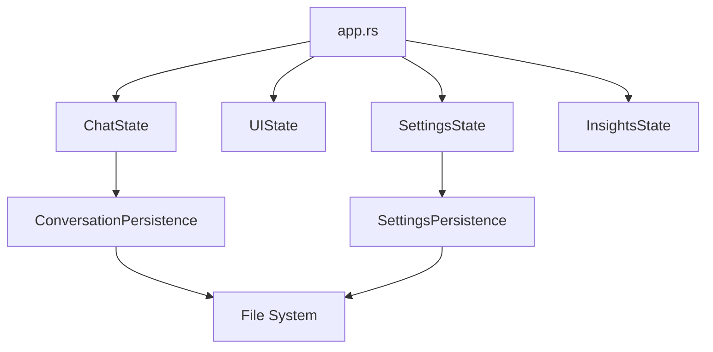

# State Management

The Notebook Native UI uses a modular state management system where application state is organized into logical modules. This document explains the state management architecture.

## State Architecture



## State Modules

### ChatState

Manages conversation state:

- **Current Conversation**: Active conversation ID
- **Messages**: Message history
- **Input**: Current input text
- **Is Sending**: Whether a message is being sent

Located in `state/chat.rs`.

### UIState

Manages UI preferences:

- **Sidebar Open**: Whether sidebar is open/closed
- **Window Positions**: Window positions and sizes
- **View Preferences**: UI view preferences

Located in `state/ui.rs`.

### SettingsState

Manages application settings:

- **API Base URL**: Backend API URL
- **Model ID**: Default model ID
- **Theme**: Theme preferences
- **Other Settings**: Various application settings

Located in `state/settings.rs`.

### InsightsState

Manages insights data:

- **Insights**: List of insights
- **Selected Insight**: Currently selected insight
- **Filters**: Insight filters

Located in `state/insights.rs`.

## State Initialization

State is initialized in `App::new()`:

```rust
let ui_state = UIState::new();
let settings_state = SettingsPersistence::load_settings()
    .unwrap_or_else(|_| SettingsState::new());
let insights_state = InsightsState::new();
```

## State Updates

State is updated in response to:
- User actions
- API responses
- Window events
- Component interactions

### Example: Updating Chat State

```rust
// Add message to conversation
self.chat_state.add_message(ChatMessage {
    role: "user".to_string(),
    content: text.to_string(),
});

// Update UI
self.chat_window.as_mut().unwrap().update_messages(&self.chat_state.messages);
```

## State Persistence

State can be persisted to disk:

### Conversation Persistence

```rust
ConversationPersistence::save_conversation(&conversation)?;
let conversation = ConversationPersistence::load_conversation(id)?;
```

### Settings Persistence

```rust
SettingsPersistence::save_settings(&settings_state)?;
let settings = SettingsPersistence::load_settings()?;
```

## State Access

State is accessed through the `App` struct:

```rust
// Read state
let current_conversation = &app.chat_state.current_conversation;

// Update state
app.chat_state.add_message(message);

// Persist state
ConversationPersistence::save_conversation(&app.chat_state.current_conversation)?;
```

## State Synchronization

State is synchronized with:
- **UI Components**: Components read state for rendering
- **API Client**: State triggers API requests
- **Persistence**: State is saved to disk

## Async State Updates

API responses update state asynchronously:

```rust
// In app.rs
pub fn check_api_responses(&mut self) {
    while let Ok(result) = self.api_response_receiver.try_recv() {
        match result {
            Ok(response) => {
                // Update state with response
                self.chat_state.add_message(response.message);
            }
            Err(e) => {
                // Handle error
            }
        }
    }
}
```

## State Validation

State is validated when:
- Loading from disk
- Receiving API responses
- User input

Invalid state is handled gracefully with fallbacks.

## Related Documentation

- [State Modules](../modules/state/index.md) - Detailed state module documentation
- [Persistence](../modules/persistence/index.md) - Data persistence layer
- [API Client](../modules/api/client.md) - API integration

